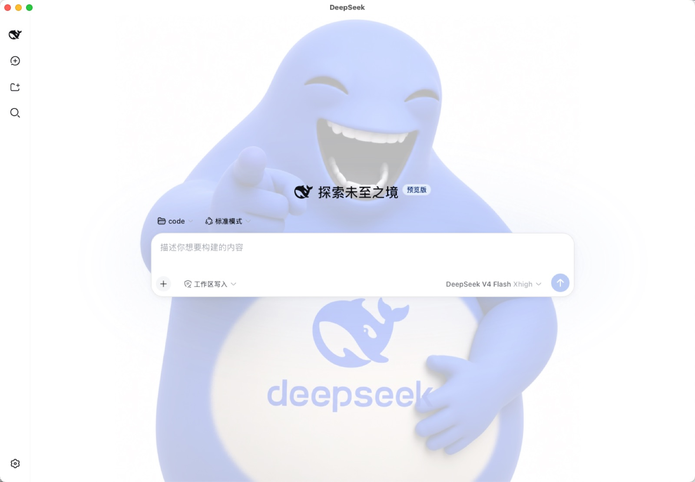

<p align="center">
  
</p>

<h1 align="center">DeepSeek Harness Desktop</h1>

<p align="center">
  <b>DeepSeek Harness 跨平台桌面客户端（macOS + Windows）</b><br>
  自定义对话背景 · 磨砂玻璃侧边栏 · 一键换肤
</p>

<p align="center">
  
  
  
  
  
</p>

---

## 这是什么

给 [DeepSeek Harness](https://github.com/deepseek-ai/deepseek-harness)（`@deepseek-ai/dsh`）套一层原生桌面壳，把网页变成真正的桌面应用：对话窗口铺满你选的背景图，侧边栏是磨砂玻璃质感，支持页面缩放，开箱即用。

- **macOS**：Swift + WKWebView 原生实现，轻量无依赖
- **Windows**：Electron 便携版，内置完整 dsh 运行时，**无需安装 Node.js**

## ✨ 功能

- 🖼️ **自定义对话背景**：任意图片铺满对话窗口，即选即换
- 🧊 **磨砂玻璃侧边栏**：毛玻璃质感，半透明透出背景
- 🐋 **默认奶鲸壁纸**：内置精选背景，开箱即美
- 🔍 **页面缩放**：`⌘+/⌘-/⌘0`（macOS）、`Ctrl+/Ctrl-/Ctrl0`（Windows）
- 💾 **背景持久化**：重启自动恢复上次选择的背景
- 🛡️ **启动自愈**：自动拉起 dsh 服务，失败时给出可诊断的错误页与日志

## 🚀 快速开始

| 平台 | 安装包 | 说明 |
|------|--------|------|
| macOS | `DeepSeek.Harness.dmg` | 双击挂载，拖入「应用程序」 |
| Windows | `DeepSeek.Harness.Setup.*.exe` | 双击运行 NSIS 安装向导 |

从 [Releases](https://github.com/EnJoy810/dsh-desktop/releases) 下载对应安装包，双击安装即可。

> **首次运行提示**：安装包未做代码签名，macOS 首次打开需「右键 → 打开」，Windows 的 SmartScreen 需点「更多信息 → 仍要运行」。

## 🔑 配置 DeepSeek API（免费）

应用内置 [SenseNova（商汤日日新）](https://platform.sensenova.cn) Provider，可直接使用其公测免费的 DeepSeek 模型（`deepseek-v4-flash`），全程免绑卡：

1. 打开 [platform.sensenova.cn](https://platform.sensenova.cn)，用手机号注册并登录
2. 进入「控制台」→「API Key 管理」，点击「创建 API Key」并复制生成的 `sk-` 开头密钥（**只显示一次**，请立即保存）
3. 将密钥提供给应用，二选一：
   - **设置环境变量**（推荐，跨平台通用）：
     ```bash
     # macOS / Linux
     export SENSENOVA_API_KEY="sk-你的密钥"   # 建议写入 ~/.zshrc
     # Windows（PowerShell）
     setx SENSENOVA_API_KEY "sk-你的密钥"     # 设置后需重启应用
     ```
   - **编辑配置文件**：首次运行后生成的 `~/.dsh/settings.yaml` 中，`llm-pi-ai.providers.sensenova.apiKeyEnv` 即引用该环境变量，保持默认即可

> **免费模型一览**：`deepseek-v4-flash`（高性能对话 / 思考模式）、`sensenova-6.7-flash-lite`（轻量多模态）、`sensenova-u1-fast`（内容生成）。接口兼容 OpenAI 格式（`https://token.sensenova.cn/v1`），免费额度每 5 小时刷新，具体配额以平台控制台为准。

## 📖 使用说明

**更换背景**：菜单 `View → Change Background…`（macOS `⌘B` / Windows `Ctrl+B`），选择任意图片立即生效；`View → Reset Background` 恢复默认。

**背景缓存位置**：

| 平台 | 路径 |
|------|------|
| macOS | `~/Library/Application Support/DeepSeek/background.jpg` |
| Windows | `%APPDATA%/DeepSeek Harness/background.jpg` |

## 📁 仓库结构

```
dsh-desktop/
├── macos/      # macOS 版（Swift + WKWebView），详见 macos/README.md
└── windows/    # Windows 版（Electron 便携），详见 windows/README.md
```

## 🔧 从源码构建

面向开发者。各平台的构建步骤见对应目录 README：

- macOS：`swiftc` 编译 + `hdiutil` 制作 dmg → [macos/README.md](macos/README.md)
- Windows：`npm run dist` 打包 NSIS 安装程序 → [windows/README.md](windows/README.md)

## 📄 许可证

[MIT](LICENSE)
