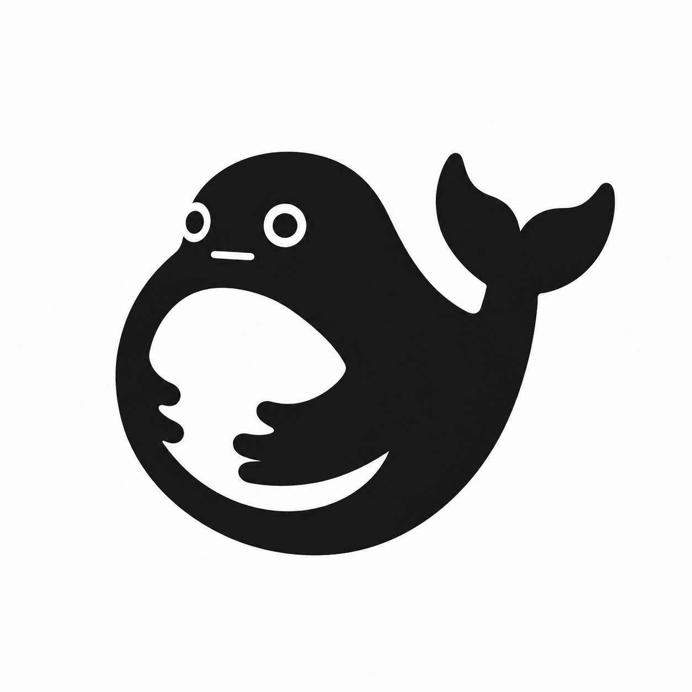

# dsh-windows

DeepSeek Harness 桌面应用 — **Windows 版**（Electron）。

这是 `dsh-macos`（Swift + WKWebView）的 Windows 移植：用 Electron 承载 DeepSeek Harness Web UI（`http://127.0.0.1:3080`），并移植了 macOS 版的全部定制功能。

## 功能

- **开箱即用（便携）**：安装包内置完整的 dsh 依赖树（`resources/vendor/`）与 `~/.dsh` 配置模板（settings.yaml + profiles）。运行时不依赖用户机器上的 Node.js——用 Electron 自身二进制以 `ELECTRON_RUN_AS_NODE` 模式作为 Node 运行时启动 dsh web server。
- 加载内置 `@deepseek-ai/dsh` web UI（`http://127.0.0.1:3080`），端口被占用时自动复用
- 自定义背景图：`View > Change Background…`（`Ctrl+B`）选任意图片作为窗口背景；`Reset Background` 恢复默认
- **内置默认背景**：6 张 DeepSeek 奶鲸系列壁纸打包在 `vendor/backgrounds/`，通过 `View > Default Background > 🐋 奶鲸 {编号}` 菜单一键切换（详见下方「内置默认背景」章节）
- **深色主题适配**：自动探测 dsh UI 主题（文字主色探针，跟随 UI 手动切换与系统深浅），深色主题下恢复 UI 深色底并压暗背景图（`brightness(0.55)`），避免浅色背景图在深色界面下刺眼；浅色主题下恢复透明背景图显示
- **实体按键换背景**：`Settings > Settings…`（`Ctrl+,`）中可绑定一个实体按键（如 `F2`、`Insert`、`PgDn`），窗口聚焦时按该键即可直接打开换背景对话框，无需组合键；配置持久化在 `%APPDATA%/DeepSeek Harness/settings.json`
- **调用余量**：读取 `~/.dsh/snova-quota.json`（token/account_id/models）轮询 SenseNova 平台 `usages` API（每 20 分钟），在 dsh 设置面板内注入「调用余量」卡片（按模型余量进度条，rAF 跟随面板定位，面板关闭自动隐藏）
- 背景持久化：缓存在 `%APPDATA%/DeepSeek Harness/background.jpg`，重启自动恢复
- 磨砂玻璃侧边栏（backdrop-filter）
- 页面缩放：`Ctrl+`=` / `Ctrl+-` / `Ctrl+0`（0.5×–3×）
- 启动失败诊断：server 日志写入 `%APPDATA%/DeepSeek Harness/dsh-server.log`，白屏时显示错误页并附日志路径

> 要求 Electron ≥ 37（内置 Node 22+），dsh 需要 `node:zlib.createZstdDecompress`（Node 22.5+）与 `node:module.stripTypeScriptTypes`（Node 22.6+）。Electron 33（Node 20）会启动失败——**不要降级**。

## 内置默认背景

`View > Default Background` 菜单内置 6 张 DeepSeek 奶鲸/奶虎鲸系列壁纸（打包在 `vendor/backgrounds/`），1–3 为品牌蓝奶鲸，4–6 为黑白奶虎鲸，按类型配对：

| 菜单项 | 预览 | 文件 | 描述 |
|---|---|---|---|
| `🐋 奶鲸 1` |  | `bg-1.jpg` | 2D 卡通奶鲸（品牌蓝） |
| `🐋 奶鲸 2` |  | `bg-2.jpg` | 3D 站姿大笑奶鲸（品牌蓝） |
| `🐋 奶鲸 3` |  | `bg-3.jpg` | 3D 笑颜奶鲸 + `deepseek` 圆形 logo（品牌蓝） |
| `🐋 奶鲸 4` |  | `bg-4.jpg` | 2D 卡通奶虎鲸 |
| `🐋 奶鲸 5` |  | `bg-5.jpg` | 3D 站姿大笑奶虎鲸 |
| `🐋 奶鲸 6` |  | `bg-6.jpg` | 3D 笑颜奶虎鲸 + `deepseek harness` 圆形 logo |

菜单项由 `listDefaultBackgrounds()` 自动扫描 `vendor/backgrounds/bg-\d+\.jpg` 动态生成，新增图片只需放入该目录、文件名匹配即可。选中后会写入 `%APPDATA%/DeepSeek Harness/background.jpg` 并立即应用；深色主题下背景图会被自动压暗（`brightness(0.55)`）以适配。

## 开发运行

```bash
npm install
npm start          # 启动 Electron，自动拉起内置 dsh web
```

> `vendor/` 目录是运行时依赖（dsh 全家桶 + win32 sharp 预编译），由 `npm run sync:vendor` 从本机 `~/.npm/_npx` 缓存同步（见下）。

## 同步 vendor（依赖树）

应用便携化依赖 `vendor/node_modules`（完整 dsh 依赖树）与 `vendor/dsh-config`（settings.yaml + profiles 模板）。从本机 npx 缓存同步：

```bash
rsync -a --delete ~/.npm/_npx/*/node_modules/ vendor/node_modules/
cp -R ~/.dsh/settings.yaml vendor/dsh-config/
cp -R ~/.dsh/profiles vendor/dsh-config/
# sharp 需补 Windows 预编译（否则 Windows 上图片处理会失败）
npm pack @img/sharp-win32-x64@0.35.3 @img/sharp-libvips-win32-x64@0.35.3
```

## 打包 Windows 安装包

```bash
npm run dist       # electron-builder --win nsis → dist/*Setup*.exe
npm run dist:dir   # 免安装绿色版 → dist/win-unpacked/
```

## 目录结构

```
src/main.js     Electron 主进程：server 生命周期、窗口、菜单、换背景、背景注入
src/preload.js  预加载桥（contextBridge，预留）
assets/bg.jpg   默认奶鲸背景
build/icon.ico  Windows 应用图标
```
